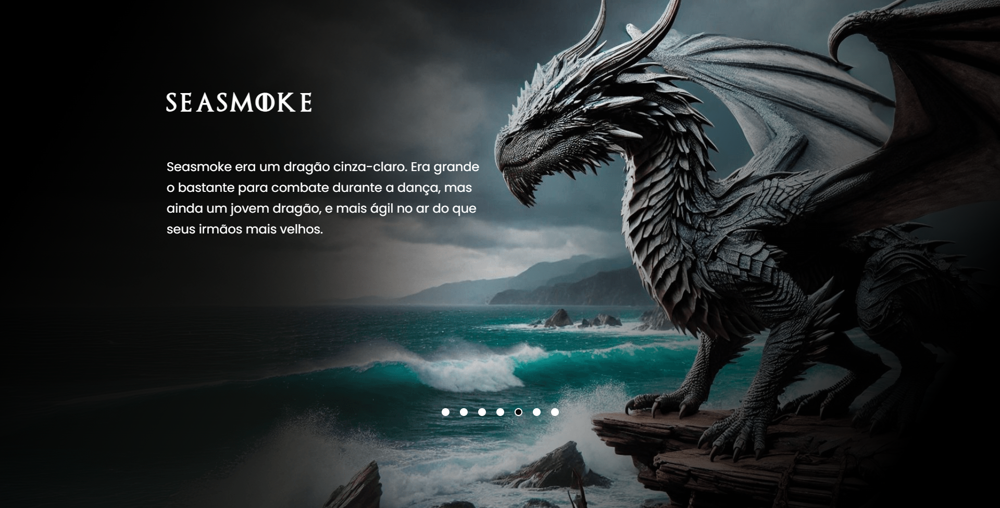

# House of the Dragon Carousel

## 📌 Descrição
Este projeto é um carrossel interativo que exibe dragões da série "House of the Dragon". Desenvolvido durante um evento online gratuito, este projeto foi uma das minhas primeiras experiências práticas em desenvolvimento web, antes de iniciar formalmente meus estudos em HTML, CSS e JavaScript no curso de Análise e Desenvolvimento de Sistemas. O carrossel permite que os usuários naveguem entre diferentes dragões, mostrando imagens e informações detalhadas sobre cada um deles. Embora eu não tivesse muita noção do que estava fazendo na época, essa experiência foi fundamental para meu crescimento, servindo como base para projetos futuros!

## 🚀 Tecnologias
- HTML
- CSS
- JavaScript

## 🎯 Objetivo
O projeto foi desenvolvido para aprimorar minhas habilidades em desenvolvimento web, com foco em manipulação do DOM e design responsivo.

## 📸 Demonstração

Você pode acessar o projeto [aqui](https://juanmolopes.github.io/projeto-hod-szpc/ "Ir para o site!").
